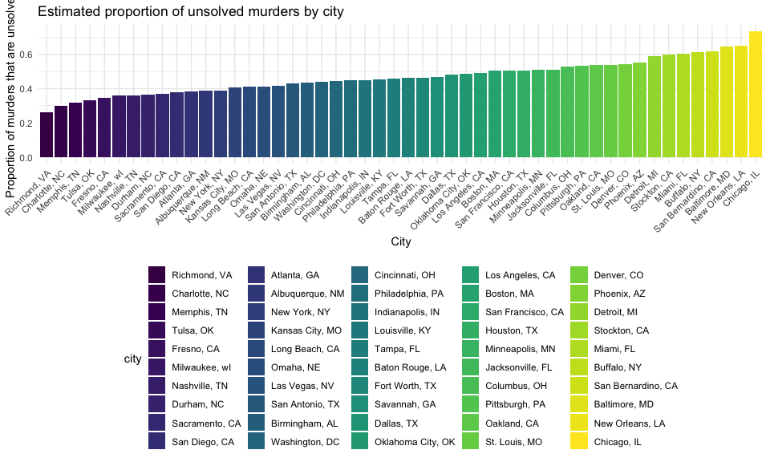

p8105_hw5_crd2162
================
Caleigh Dwyer
2023-11-13

## Problem 1: Homicide Data

The chunk below loads data from the Washington Post on homicide trends
in the 50 largest US cities.

``` r
murder_data =
  read_csv("./data/homicide-data.csv") |> 
  janitor::clean_names() |> 
  select(-uid, -victim_last, -victim_first) |> 
  unite(city_state, city, state, sep = ", ") |> 
  mutate(city_state = 
           if_else(
             city_state == "Tulsa, AL", "Tulsa, OK", city_state
           ))
```

    ## Rows: 52179 Columns: 12
    ## ── Column specification ────────────────────────────────────────────────────────
    ## Delimiter: ","
    ## chr (9): uid, victim_last, victim_first, victim_race, victim_age, victim_sex...
    ## dbl (3): reported_date, lat, lon
    ## 
    ## ℹ Use `spec()` to retrieve the full column specification for this data.
    ## ℹ Specify the column types or set `show_col_types = FALSE` to quiet this message.

The dataset contains information on 52179 criminal homicides reported
from 2007 to 2015. The dataset describes the race, age, and sex of each
victim, the city and state in which the homicide occurred, the exact
latitude and longitude of the crime, and the “disposition” of the crime,
which describes whether the case is open or closed and whether an arrest
was made. One homicide was misattributed to Tulsa, Alabama when the
latitude and longitude indicate that the crime occurred in Oklahoma;
this was corrected in the cleaned dataset.

The following chunk summarizes the total number of homicides in each
city. Chicago, Philadelphia, Houston, Baltimore, and Detroit had the
highest number of total homicides, in that order.

``` r
murder_data |> 
  count(city_state) |> 
  arrange(desc(n)) |> 
  knitr::kable()
```

| city_state         |    n |
|:-------------------|-----:|
| Chicago, IL        | 5535 |
| Philadelphia, PA   | 3037 |
| Houston, TX        | 2942 |
| Baltimore, MD      | 2827 |
| Detroit, MI        | 2519 |
| Los Angeles, CA    | 2257 |
| St. Louis, MO      | 1677 |
| Dallas, TX         | 1567 |
| Memphis, TN        | 1514 |
| New Orleans, LA    | 1434 |
| Las Vegas, NV      | 1381 |
| Washington, DC     | 1345 |
| Indianapolis, IN   | 1322 |
| Kansas City, MO    | 1190 |
| Jacksonville, FL   | 1168 |
| Milwaukee, wI      | 1115 |
| Columbus, OH       | 1084 |
| Atlanta, GA        |  973 |
| Oakland, CA        |  947 |
| Phoenix, AZ        |  914 |
| San Antonio, TX    |  833 |
| Birmingham, AL     |  800 |
| Nashville, TN      |  767 |
| Miami, FL          |  744 |
| Cincinnati, OH     |  694 |
| Charlotte, NC      |  687 |
| Oklahoma City, OK  |  672 |
| San Francisco, CA  |  663 |
| Pittsburgh, PA     |  631 |
| New York, NY       |  627 |
| Boston, MA         |  614 |
| Tulsa, OK          |  584 |
| Louisville, KY     |  576 |
| Fort Worth, TX     |  549 |
| Buffalo, NY        |  521 |
| Fresno, CA         |  487 |
| San Diego, CA      |  461 |
| Stockton, CA       |  444 |
| Richmond, VA       |  429 |
| Baton Rouge, LA    |  424 |
| Omaha, NE          |  409 |
| Albuquerque, NM    |  378 |
| Long Beach, CA     |  378 |
| Sacramento, CA     |  376 |
| Minneapolis, MN    |  366 |
| Denver, CO         |  312 |
| Durham, NC         |  276 |
| San Bernardino, CA |  275 |
| Savannah, GA       |  246 |
| Tampa, FL          |  208 |

The following chunk summarizes the total number of unsolved homicides in
each city, or those in which the disposition is “Closed without arrest”
or “Open/No arrest”. Chicago, Baltimore, Houston, Detroit, and
Philadelphia had the highest number of unsolved homicides, in that
order.

``` r
murder_data |> 
  filter(disposition %in% c("Closed without arrest", "Open/No arrest")) |> 
  count(city_state) |> 
  arrange(desc(n)) |> 
  knitr::kable()
```

| city_state         |    n |
|:-------------------|-----:|
| Chicago, IL        | 4073 |
| Baltimore, MD      | 1825 |
| Houston, TX        | 1493 |
| Detroit, MI        | 1482 |
| Philadelphia, PA   | 1360 |
| Los Angeles, CA    | 1106 |
| New Orleans, LA    |  930 |
| St. Louis, MO      |  905 |
| Dallas, TX         |  754 |
| Jacksonville, FL   |  597 |
| Indianapolis, IN   |  594 |
| Washington, DC     |  589 |
| Columbus, OH       |  575 |
| Las Vegas, NV      |  572 |
| Oakland, CA        |  508 |
| Phoenix, AZ        |  504 |
| Kansas City, MO    |  486 |
| Memphis, TN        |  483 |
| Miami, FL          |  450 |
| Milwaukee, wI      |  403 |
| Atlanta, GA        |  373 |
| San Antonio, TX    |  357 |
| Birmingham, AL     |  347 |
| Pittsburgh, PA     |  337 |
| San Francisco, CA  |  336 |
| Oklahoma City, OK  |  326 |
| Buffalo, NY        |  319 |
| Boston, MA         |  310 |
| Cincinnati, OH     |  309 |
| Nashville, TN      |  278 |
| Stockton, CA       |  266 |
| Louisville, KY     |  261 |
| Fort Worth, TX     |  255 |
| New York, NY       |  243 |
| Charlotte, NC      |  206 |
| Baton Rouge, LA    |  196 |
| Tulsa, OK          |  193 |
| Minneapolis, MN    |  187 |
| San Diego, CA      |  175 |
| San Bernardino, CA |  170 |
| Denver, CO         |  169 |
| Fresno, CA         |  169 |
| Omaha, NE          |  169 |
| Long Beach, CA     |  156 |
| Albuquerque, NM    |  146 |
| Sacramento, CA     |  139 |
| Savannah, GA       |  115 |
| Richmond, VA       |  113 |
| Durham, NC         |  101 |
| Tampa, FL          |   95 |

We will now use the prop.test function to estimate the proportion of
homicides that are unsolved in Baltimore, MD. The estimated proportion
of unsolved homicides in Baltimore was 64.6% with a confidence interval
of 62.8%-66.3%

``` r
prop_bmd =
murder_data |> 
  filter(city_state == "Baltimore, MD") |> 
  summarize(
    total_murder = n(),
    total_unsolved = sum(
           disposition %in% c("Closed without arrest", "Open/No arrest")
         )) |> 
  with(prop.test(total_unsolved,total_murder)) |> 
  broom::tidy() |> 
  select(estimate, conf.low, conf.high)

print(prop_bmd)
```

    ## # A tibble: 1 × 3
    ##   estimate conf.low conf.high
    ##      <dbl>    <dbl>     <dbl>
    ## 1    0.646    0.628     0.663

The chunk below creates a function that applies the prop.test used
above, producing the estimated proportion of unsolved murders for each
input along with the confidence interval. Then, map is used to pass a
list of the 50 cities through the function, producing the output for
each city. The outputs are then consolidated into a tibble.

``` r
# function 
prop_function <- function(dataset, name) {
  prop = dataset |> 
  filter(city_state == name) |> 
  summarize(
    total_murder = n(),
    total_unsolved = sum(
           disposition %in% c("Closed without arrest", "Open/No arrest")
         )) |> 
  with(prop.test(total_unsolved,total_murder)) |> 
  broom::tidy() |> 
  select(estimate, conf.low, conf.high)
  return(prop)
}

cities = unique(murder_data$city_state)
table = map(cities, ~ prop_function(murder_data, .x))

# Using list columns
# Unnesting the list column
prob_unsolved = 
  tibble(city = cities, prop = table) |> 
  unnest(cols = c(prop))
```

The chunk below produces a plot showing the estimates and confidence
intervals for each city.

``` r
unsolved_plot =
  prob_unsolved |> 
  mutate(city = forcats::fct_reorder(city, estimate)) |> 
ggplot(aes(x = city, y = estimate, fill = city))+
  geom_bar(stat = "identity")+
   geom_errorbar(
    aes(ymin = conf.low, ymax = conf.high),
    position = position_dodge(width = 0.9),
    width = 0.25
  ) +
  labs(title = "Estimated proportion of unsolved murders by city", x = "City", y = "Proportion of murders that are unsolved") +
  theme(axis.text.x = element_text(angle = 45, hjust = 1))

print(unsolved_plot)
```


