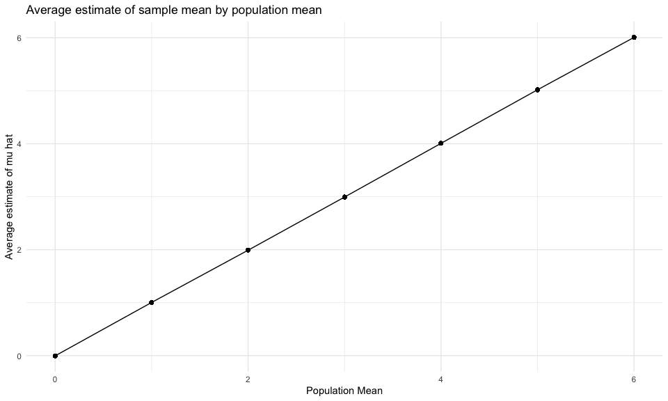
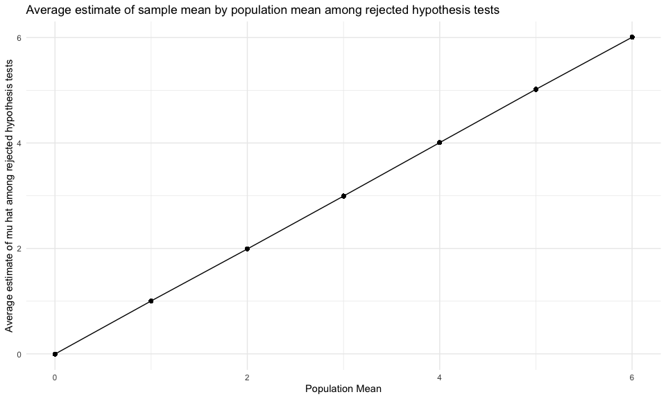

p8105_hw5_crd2162
================
Caleigh Dwyer
2023-11-13

## Problem 1

For this problem, we are interested in data gathered and made public by
*The Washington Post* on homicides in 50 large U.S. cities. The code
chunk below imports and cleans the data.

``` r
homicide_df = 
  read_csv("data/homicide-data.csv", na = c("", "NA", "Unknown")) |> 
  mutate(
    city_state = str_c(city, state, sep = ", "),
    resolution = case_when(
      disposition == "Closed without arrest" ~ "unsolved",
      disposition == "Open/No arrest"        ~ "unsolved",
      disposition == "Closed by arrest"      ~ "solved"
    )
  ) |> 
  filter(city_state != "Tulsa, AL") 
```

    ## Rows: 52179 Columns: 12
    ## ── Column specification ────────────────────────────────────────────────────────
    ## Delimiter: ","
    ## chr (8): uid, victim_last, victim_first, victim_race, victim_sex, city, stat...
    ## dbl (4): reported_date, victim_age, lat, lon
    ## 
    ## ℹ Use `spec()` to retrieve the full column specification for this data.
    ## ℹ Specify the column types or set `show_col_types = FALSE` to quiet this message.

The resulting dataframe has 52178 entries, on variables that include the
victim name, race, age, and sex; the date the homicide was reported; and
the location of the homicide. In cleaning, I created a `city_state`
variable that includes both city and state, and a `resolution` variable
to indicate whether the case was closed by arrest. I also excluded one
entry in Tulsa, AL, which is not a major US city and is most likely a
data entry error.

In the next code chunk, I group within cities and summarize to produce
the total number of homicides and the number that are solved.

``` r
city_homicide_df = 
  homicide_df |> 
  select(city_state, disposition, resolution) |> 
  group_by(city_state) |> 
  summarize(
    hom_total = n(),
    hom_unsolved = sum(resolution == "unsolved"))
```

Focusing only on Baltimore, MD, I can use the `prop.test` and
`broom::tidy` functions to obtain an estimate and CI of the proportion
of unsolved homicides in that city. The table below shows those values.

``` r
bmore_test = 
  prop.test(
    x = filter(city_homicide_df, city_state == "Baltimore, MD") |>  pull(hom_unsolved),
    n = filter(city_homicide_df, city_state == "Baltimore, MD") |>  pull(hom_total)) 

broom::tidy(bmore_test) |> 
  knitr::kable(digits = 3)
```

| estimate | statistic | p.value | parameter | conf.low | conf.high | method                                               | alternative |
|---------:|----------:|--------:|----------:|---------:|----------:|:-----------------------------------------------------|:------------|
|    0.646 |   239.011 |       0 |         1 |    0.628 |     0.663 | 1-sample proportions test with continuity correction | two.sided   |

Building on this code, I can use functions in the `purrr` package to
obtain estimates and CIs for the proportion of unsolved homicides in
each city in my dataset. The code below implements this analysis.

``` r
test_results = 
  city_homicide_df |>  
  mutate(
    prop_tests = map2(hom_unsolved, hom_total, \(x, y) prop.test(x = x, n = y)),
    tidy_tests = map(prop_tests, broom::tidy)) |>  
  select(-prop_tests) |> 
  unnest(tidy_tests)|> 
  select(city_state, estimate, conf.low, conf.high) |> 
  mutate(city_state = fct_reorder(city_state, estimate))
```

Finally, I make a plot showing the estimate (and CI) of the proportion
of unsolved homicides in each city.

``` r
test_results |>  
  mutate(city_state = fct_reorder(city_state, estimate)) |>  
  ggplot(aes(x = city_state, y = estimate)) + 
  geom_point() + 
  geom_errorbar(aes(ymin = conf.low, ymax = conf.high)) + 
  theme(axis.text.x = element_text(angle = 90, hjust = 1))
```


This figure suggests a very wide range in the rate at which homicides
are solved – Chicago is noticeably high and, given the narrowness of the
CI, likely is the location of many homicides.

## Problem 2: Experimental data

The following chunk uses a function to read multiple csv files from a
zip folder. Each .csv file represents longitudinal data for either a
control or experimental group subject.

``` r
zip_data =
list.files(path = "./data/data_csv", full.names = TRUE)

#example
subject_data = 
    read_csv("./data/data_csv/con_01.csv") |> 
    janitor::clean_names()
  
# function 
read_function = function(filename) {
  subject_data = 
    read_csv(filename) |> 
    janitor::clean_names()
  return(subject_data)
}

#map

table = map(zip_data, ~ read_function(.x))

all_data = 
  tibble(subject = zip_data, subject_data = table) |> 
  unnest(cols = c(subject_data))
```

The combined dataset containing data for all subjects will be tidied in
the following chunk.The subject ID was pulled from the file name,
creating a new column called “id”. The experimental group was then
pulled from the “id,” creating a new column called “group”.

``` r
tidy_data =
  all_data |> 
  mutate(
    id = sub(".csv", "", basename(subject)),
    group = ifelse(str_detect(id, "^exp"), "experimental", "control")) |> 
  pivot_longer(week_1:week_8,
               names_to = "time_point",
               values_to = "observation") |> 
  select(id, group, everything(), -subject)
```

A spaghetti plot is created in the chunk below showing observations on
each subject over time by group. This graph shows that the experimental
group had greater change in the value of the observation over time, as
the value of the observation at week 8 is higher among all experimental
group subjects compared to control group, even thought experimental and
control group subjects had simillar observation values at baseline.

``` r
subject_graph =
  tidy_data |> 
  ggplot(aes(x = time_point, y = observation, group = id, color = group))+
  geom_point()+
  geom_line()+
  labs(title = "Changes in observation by subject and group over 8 weeks", x = "Week", y = "Observation") +
  theme(axis.text.x = element_text(angle = 45, hjust = 1))

print(subject_graph)
```


## Problem 3: Simulation

In this problem, we will conduct a simulation to explore power in a one
sample t-test.

First, I will write a function called sim_power to create a random
sample from a normal distribution with an n of 30, a sigma of 5, and a
mu of 0. This function also calculates the sample mean (mu_hat) and
sample sigma (sigma_hat). The sample is then returned as a tibble.

``` r
set.seed(1)

#write a function to define parameters
sim_power = function(n = 30, sigma = 5, mu = 0){
  sim_data = tibble(
    x = rnorm(n, mean = mu, sd = sigma),
  )
  
  sim_data |> 
    summarize(
      mu_hat = mean(x),
      sigma_hat = sd(x)
    )
  
  return(sim_data)
}
```

Then, I will use map to conduct 5000 iterations of the function above.
The results of the iterations are saved as a dataframe called
sim_results.

``` r
#create dataset including 5000 iterations of function above
sim_results =
  expand_grid(
    n = 30,
    iter = 1:5000
  ) |> 
  mutate(
    estimate_df = map(n, sim_power)
  )
```

I will then write a function called sim_power_repeat in which the same
5000 iterations can be done, except the mu can be changed. This function
also maps a tidied t-test to the 5000 iterations. It is a test of the
hypothesis of mu = 0 using alpha = 0.05. The outputs from the t-tests
are saved as a dataframe called estimates which are then unnested by the
function. The unnested results of the t-tests on the iterations in this
function are returned as “df”.

``` r
#write function to run t test. Mu can be changed.
sim_power_repeat = function(mu) {
  df = expand_grid(
    n = 30,
    iter = 1:5000
  ) |> 
  mutate(
    population_mean = mu,
    estimate_df = map(n, sim_power),
    estimates = map(estimate_df, ~ broom::tidy(t.test(.x, mu = mu)))
  ) |> 
  unnest(c(estimates))
  return(df)
}
```

Now we run the sim_power_repeat function using map. In the chunk below,
the sim_power_repeat function is mapped to 7 different iterations of mu
(mu = 0:6). The 7 different iterations are then combined used bind_rows
and consolidated into a dataframe called final_sim_results.

``` r
#run t test function nfor 7 different mu and combine outputs
final_sim_results =   
  map(0:6, ~ sim_power_repeat(.x)) |> 
  bind_rows()
```

Finally, the dataframe is tidied and called `final_sim_clean`. This
dataframe includes only necessary columns and to include a new variable
that calculates whether the null hypothesis was accepted or rejected
called `null_hyp`. This variable is then used to calculate `power` for
each population mean.

``` r
final_sim_clean =
final_sim_results |> 
  select(iter, population_mean, estimate, p.value, conf.low, conf.high) |> 
  rename(mu_hat = estimate) |> 
  mutate(
    null_hyp = ifelse(
                 p.value > 0.05, "accept", "reject"
              )) |> 
  group_by(population_mean) |> 
  mutate(
    total_accept = sum(null_hyp == "accept"),
    total_reject = sum(null_hyp == "reject"),
  power = total_reject/(total_reject + total_accept),
  average_mu_hat = mean(mu_hat))
```

Now I will create a plot that shows the proportion of times the null was
rejected (`power`) on the y axis and the true value of mu on the x axis.
This plot shows that as the true population mean (the effect size)
increases, so does the power.

``` r
sim_plot_1 =
final_sim_clean |> 
ggplot(aes(x = population_mean, y = power))+
geom_point()+
geom_line() +
labs(title = "Power increases as true mean increases", x = "True Mean", y = "Power")

print(sim_plot_1)
```


Next, we’ll make a plot showing the average estimate of mu_hat on the y
axis and the true value of the population mean on the x axis. There does
not appear to be a linear pattern to the average estiamte of mu hat as
the population mean increases.

``` r
sim_plot_2 =
final_sim_clean |> 
ggplot(aes(x = population_mean, y = average_mu_hat))+
geom_point()+
geom_line() +
labs(title = "Average estimate of sample mean by population mean", x = "Population Mean", y = "Average estimate of mu hat")

print(sim_plot_2)
```



Lastly, we’ll create a plot that shows the average estimate of mu hat
only in samples for which the null was rejected on the y axis and the
true value of mu on the x axis. This plot looks almost the same as the
second plot created above, despite the fact that it only includes sample
means from in which the null hypothesis was rejected. It does not appear
that the sample average of mu hat across tests for which the null is
rejected approximates the true value of mu. The sample average of mu hat
across tests is very close to 0. This is likely because the effect size
and sample size are both very small for this simulation, reducing the
power. A higher level of power is necessary to reject a false null
hypothesis.

``` r
sim_plot_3 =
final_sim_clean |> 
  filter(null_hyp == "reject") |> 
ggplot(aes(x = population_mean, y = average_mu_hat))+
geom_point()+
geom_line() +
labs(title = "Average estimate of sample mean by population mean among rejected hypothesis tests", x = "Population Mean", y = "Average estimate of mu hat among rejected hypothesis tests")

print(sim_plot_3)
```


